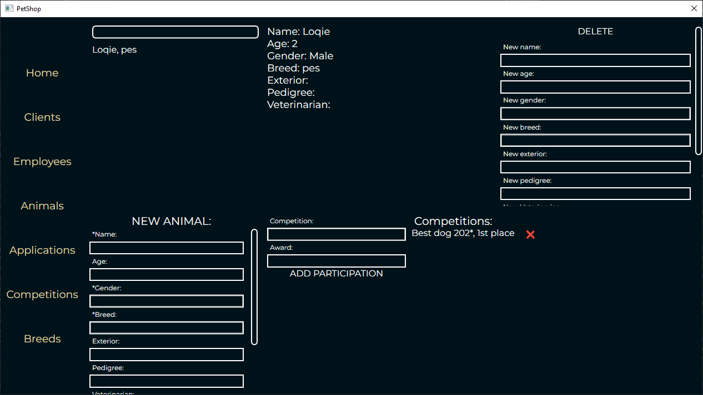
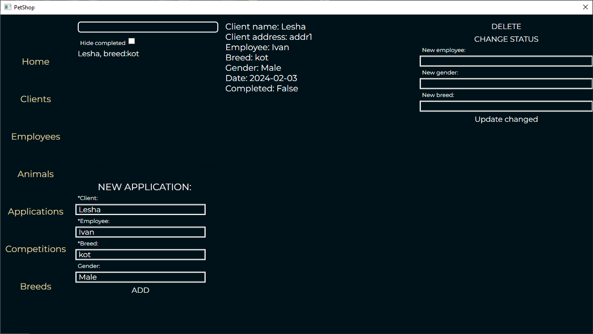

# PetShop

It's an WPF + NHibernate application for non-existent pet shop that helps manage clients, employees, animals, etc. It was made for university project and not finished to the state that I would like.

# Troubles

I encountered difficulties with NHibernate, cascades and syncronizing changes specifically, application has a lot of issues in this context;
